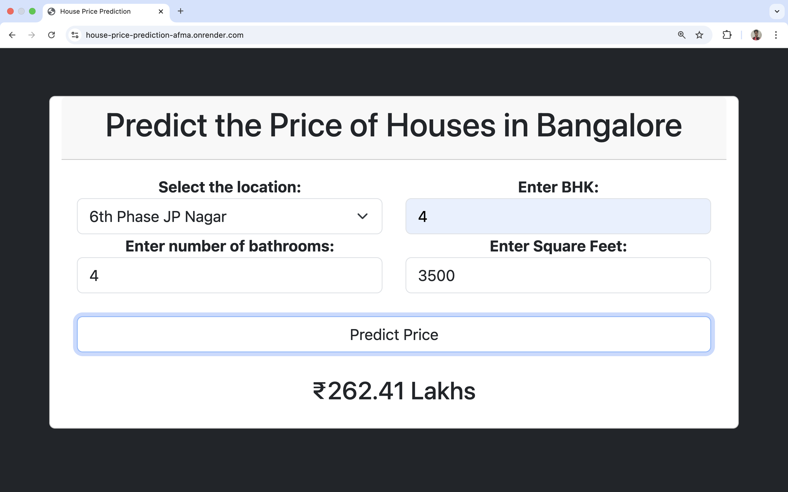
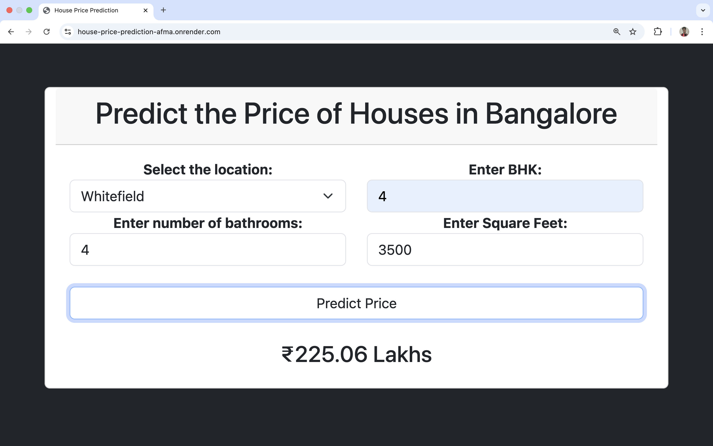
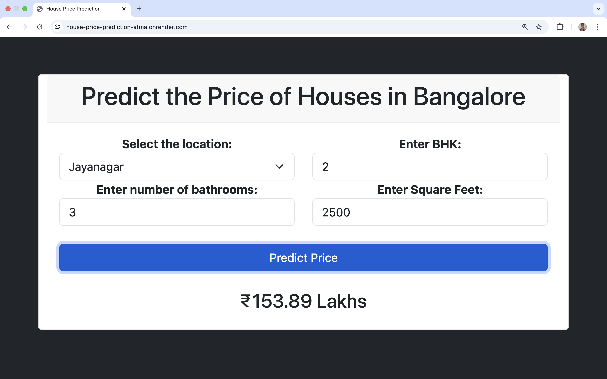

# House Price Prediction Web App

Live Demo: [https://house-price-prediction-afma.onrender.com/](https://house-price-prediction-afma.onrender.com/)

This is a machine learning-powered web application that predicts house prices in Bengaluru using Linear Regression. Built with Flask and deployed on Render.

---

## Project Overview

This project converts raw housing data into a production-ready prediction tool. It uses machine learning for accurate price estimation and a web interface for easy user interaction.

---

## 📂 Repository Structure

```
├── .ipynb_checkpoints/            # Jupyter notebook auto-save checkpoints
├── data/                          # Raw CSV data
├── demo/                          # Screenshots of working web app
│   ├── pic1.jpg                   # App Homepage
│   ├── pic2.jpg                   # User Input Form
│   └── pic3.jpg                   # Prediction Output
├── templates/                     # HTML templates (form + result)
├── .python-version                # Python version for deployment
├── House_Price_Prediction.ipynb  # Notebook with EDA + model training
├── LICENSE                        # MIT License
├── README.md                      # Project documentation
├── main.py                        # Flask backend
├── model.pkl                      # Trained ML pipeline (preprocessing + model)
├── render.yaml                    # Render deployment configuration
├── requirements.txt              # Required Python libraries
```

## Steps Followed

1. Data Cleaning & Preprocessing

   * Removed unnecessary columns (area\_type, society, etc.)
   * Handled missing values and outliers
   * Standardized price\_per\_sqft values by filtering within \[mean ± std\_dev]
   * Encoded categorical variables using One-Hot Encoding

2. Exploratory Data Analysis (EDA)

   * Analyzed distributions using Seaborn
   * Visualized the relationship between price and features
   * Handled locations with very low frequency by grouping them into an "Other" category

3. Feature Engineering

   * Created a new BHK feature from the size column
   * Ensured that the bathrooms count did not exceed BHK + 2

4. Model Training & Evaluation

   * Used Linear Regression, Lasso, and Ridge Regression
   * Evaluated models using R² Score:

     * Linear Regression: \~0.80
     * Lasso Regression: \~0.79
     * Ridge Regression: \~0.80

---

## Results & Insights

* The model achieves \~80% accuracy, meaning it explains 80% of the variance in house prices.
* Feature engineering and outlier handling significantly improved model robustness and generalization.
* Linear models performed well due to the limited number of features and preprocessing steps.

---

## Web App Features

Users can input the following:

* Location
* BHK (Bedrooms)
* Number of Bathrooms
* Total Square Footage

The app then returns the predicted house price in lakhs (₹).

---

## How to Run the Project Locally

1. Clone the Repository

```
git clone https://github.com/Nishant840/House-Price-Prediction.git
cd House-Price-Prediction
```

2. Create and Activate Virtual Environment

```
python -m venv venv
source venv/bin/activate      # On Windows: venv\Scripts\activate
```

3. Install Dependencies

```
pip install -r requirements.txt
```

4. Run the Flask App

```
python main.py
```

Then open your browser and go to: [http://localhost:5000](http://localhost:5000)

---

## Deployment Info

* Platform: Render
* Python Version: 3.10.13 (via `.python-version`)
* Auto-deployment configured with `render.yaml`
* Gunicorn used as WSGI HTTP server

Live app link: [https://house-price-prediction-afma.onrender.com/](https://house-price-prediction-afma.onrender.com/)

---

## Environment Details

* Python: 3.10.13
* Flask: 3.1.0
* pandas: 2.2.2
* numpy: 1.26.4
* scikit-learn: 1.4.2
* gunicorn: 21.2.0

---

## 🖼️ Sample Predictions for Different Inputs

Below are screenshots showing how the app responds to different house input features:

### 🏠 Prediction Example 1


### 🏠 Prediction Example 2


### 🏠 Prediction Example 3



## License

This project is licensed under the MIT License.

---

## Acknowledgements

* Dataset: Kaggle - Bengaluru House Price Data
* Libraries: scikit-learn, pandas, numpy
* Deployment: Render with Flask and Gunicorn
